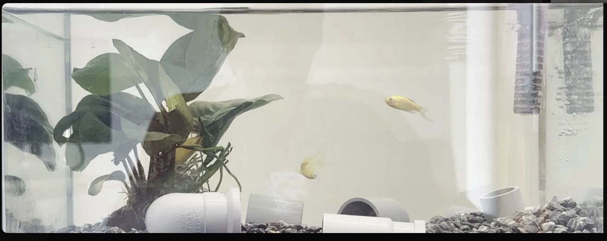
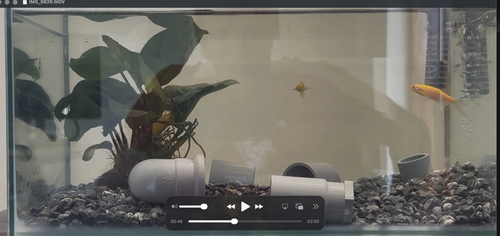
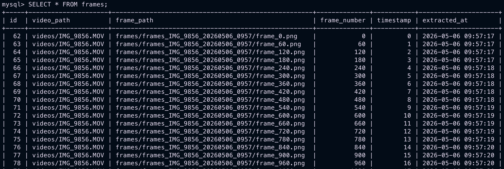

# **Stage 1 — Frame Extraction and MySQL Storage**

Stage 1 implements the initial ingestion layer of the AquaMind pipeline, transforming raw aquarium video footage into a structured, frame-level dataset suitable for downstream machine learning tasks.

The pipeline converts continuous video data into discrete, indexed image samples and stores both the extracted frames and their metadata in a MySQL database. This enables later linking with annotation data and supports reproducible dataset construction for model training.

```text
Video → Frame Sampling → Persistent Storage (Disk + MySQL) → ML Dataset
```

## System Prerequisites

### Environment Setup

A dedicated Conda environment (`aquamind`) was created using Python 3.11 to isolate project dependencies and ensure reproducibility across development machines.

```bash
conda create -n aquamind python=3.11
conda activate aquamind
pip install opencv-python mysql-connector-python
```

Core dependencies:

- `opencv-python` — video decoding and frame extraction
- `mysql-connector-python` — relational database connectivity
- `os`, `datetime` — standard library modules for file system and timestamp management

## Data Acquisition Considerations

### Video Encoding Constraints

Initial recordings using iPhone 14 (iOS 26) in HEVC (H.265) format introduced frame-level colour inconsistencies when processed with OpenCV, resulting in degraded colour fidelity during extraction.

This issue comes from how inter-frame compression works: modern codecs store occasional full frames and encode only the pixel differences between them to reduce file size. When OpenCV's software decoder processes an HEVC-encoded file, colour reconstruction can break down during this decoding process, producing washed-out frames.

<figure markdown="span">
  { width="700" }
  <figcaption style="margin-top: -0.5em;">
    Faded colours extracted from HEVC-encoded MOV file
  </figcaption>
</figure>

To ensure deterministic frame decoding, the recording format on iPhone was switched to H.264 ("Most Compatible" mode). Although this increased storage size, it significantly improved frame consistency and colour stability during extraction.

<figure markdown="span">
  { width="700" }
  <figcaption style="margin-top: -0.5em;">
    Correct colour reproduction after switching to H.264
  </figcaption>
</figure>

Recordings were standardised at 60 FPS to increase temporal resolution, enabling finer capture of fast behavioural events of fish such as feeding strikes.

## Infrastructure Setup

### Database Deployment

A MySQL 8.4 instance was deployed inside a Docker container to ensure environment isolation and avoid conflicts with local database installations. Port 3306 is exposed to the local machine, enabling connectivity from both Python scripts and MySQL Workbench.

```bash
docker run \
  --name cont-aquamind-sql \
  -e MYSQL_ROOT_PASSWORD=aquamind \
  -e MYSQL_DATABASE=aquamind \
  -p 3306:3306 \
  -d mysql:8.4
```

The container status is verified using:

```bash
docker ps
```

This confirms that the container is running and that port 3306 is correctly mapped to the local machine. Once confirmed, the MySQL shell is accessed directly inside the container:

```bash
docker exec -it cont-aquamind-sql mysql -u root -paquamind
```

Database and table verification:

```sql
SHOW DATABASES;
USE aquamind;
SHOW TABLES;
DESCRIBE frames;
```

MySQL Workbench was used for inspection and debugging with the following connection settings:

| Field    | Value     |
|----------|-----------|
| Host     | 127.0.0.1 |
| Port     | 3306      |
| Username | root      |
| Password | aquamind  |

## Database Schema

Frame-level metadata is stored in a single relational table designed for traceability and downstream dataset reconstruction. This structure ensures each frame can be traced back to its source video, aligned temporally with other frames, and later linked to annotation data in subsequent pipeline stages.

```sql
CREATE TABLE frames (
    id           INT AUTO_INCREMENT PRIMARY KEY,  -- unique row identifier
    video_path   VARCHAR(255),                    -- path to the source video file
    frame_path   VARCHAR(255),                    -- path to the saved PNG frame on disk
    frame_number INT,                             -- frame index in the original video
    timestamp    FLOAT,                           -- seconds from video start
    extracted_at TIMESTAMP                        -- system time of extraction
  );
```

## Frame Extraction Pipeline

### Source Code      
<a href="https://github.com/govinda-lienart/AquaMind/blob/main/extract_frames.py" target="_blank">View source on GitHub</a>                                                 

### Design Overview

The pipeline reads video files sequentially using OpenCV and extracts frames at a fixed rate of one frame per second. Each extracted frame is saved both as an image file and as a structured record in a MySQL database. This design transforms raw video data into a structured dataset that can be used later for annotation and machine learning model training.

### Video Parsing and Output Structuring

Each video is processed independently. For every run, the system creates a unique output folder using the video name combined with a timestamp (e.g. `frames_IMG_9856_20260511_1430`). This ensures that no previous outputs are overwritten and that each extraction session is clearly separated and traceable.

The resulting directory structure follows the pattern `frames/frames_<video_name>_<timestamp>/`, allowing each dataset generation run to be uniquely identified at the filesystem level.

### Frame Rate Normalisation

The frame rate of each video is retrieved directly using OpenCV. However, iPhone recordings give a frame rate of `59.94` FPS instead of a clean `60` FPS due to underlying NTSC video encoding standards. If used directly, this small discrepancy causes `frame_count % fps == 0` to select frames inconsistently.

To ensure stable and predictable extraction intervals, the FPS value is wrapped in `round()` to normalise it to the nearest integer (60fps) before being used in the sampling logic.

### Sampling Strategy

Frames are selected using the expression `frame_count % fps == 0`, which ensures that exactly one frame per second. The video is read frame by frame using OpenCV, which returns two values on each call: a boolean `ret` indicating whether a frame was successfully read, and `frame`, the image data itself. When `ret` becomes `False`, the video has reached its end and the loop terminates automatically.

### Frame Storage

Each selected frame is saved as a PNG image to preserve full image quality without any compression loss. This choice is important because the dataset is intended for future annotation and machine learning tasks where pixel-level accuracy matters.

For every extracted frame, the system records its index and calculates its timestamp in seconds relative to the start of the video using `frame_count / fps`. These values ensure that each image can be accurately placed back into its original temporal context when needed.

### Metadata Storage

For every extracted frame, a corresponding record is stored in the MySQL database. This record includes the original video path, the saved frame path on disk, the frame number, the timestamp in seconds, and the exact time at which the frame was extracted. This structure allows every frame to be traced back to its source video, aligned temporally with other frames, and later linked to annotations or labels in downstream stages of the pipeline.

### Saving and Cleanup

Once extraction is complete, `conn.commit()` permanently saves all inserted rows to the database. The video stream is then closed with `cap.release()` and the database connection with `conn.close()`. These steps ensure data integrity and prevent resource leaks during batch processing.

## Validation

Correctness of ingestion is verified via:

```sql
SELECT * FROM frames;
```

Expected properties include sequential frame indexing aligned with the sampling rate, consistent 1-second timestamp increments, valid file path references to the stored PNG frames, and correct separation between different extraction runs in the filesystem.

<figure markdown="span">
  { width="700" }
  <figcaption style="margin-top: -0.5em;">
    Verification of SQL table structure and inserts
  </figcaption>
</figure>

## Outcome

Stage 1 establishes a reproducible ingestion pipeline that converts raw aquarium video into a structured frame dataset with persistent metadata tracking.

The system successfully decodes video streams reliably using H.264-encoded input, extracts temporally consistent frames at 1 FPS, stores lossless PNG images on disk with run-level versioning, and persists structured metadata in a MySQL database running inside a Dockerised environment.

This stage forms the foundational dataset layer for subsequent annotation, labelling, and machine learning model training within the AquaMind pipeline.
