# Stage 2 — Label and Store Annotations in MySQL

Stage 2 implements the annotation layer of the AquaMind pipeline, where each extracted frame from Stage 1 is manually labelled by drawing bounding boxes around every visible fish. This process transforms the raw frame dataset into a supervised learning dataset by adding object-level labels to each image.

To store these labels in a structured way, a new annotations table is created in MySQL. Each annotation represents a single bounding box for one fish and is linked back to its corresponding frame via a foreign key (frame_id). The labels are also exported in YOLO format to support model training.

```text
Video → Frames → Annotations → Database → AI model
```

## System Prerequisites

### Environment Setup

The same `aquamind` Conda environment from Stage 1 is used. No additional Python packages are required — `mysql-connector-python`, `os`, and `datetime` are already installed.

### Labelling Tool

Label Studio is used for manual annotation and is launched as a Docker container. No local installation is required beyond Docker Desktop being active.

## Environment & Infrastructure Setup

### Label Studio Setup

Label Studio is launched as a single Docker container using the `heartexlabs/label-studio:latest` image. Port 8080 is mapped to the host machine and a volume mount using `-v $(pwd)/mydata:/label-studio/data` gives Label Studio persistent storage — all annotation data is written to the local `mydata` folder on the host machine rather than inside the container, meaning the work is preserved even if the container stops or is restarted.

```bash
docker run -it -p 8080:8080 -v $(pwd)/mydata:/label-studio/data heartexlabs/label-studio:latest
```
## Project Configuration


## Annotation

Inside Label Studio, a new project named AquaMind is created. The labelling interface is configured by navigating to Settings → Labelling Interface, selecting the Computer Vision category, and choosing the Object Detection with Bounding Boxes template. A single label class named `"danio_rerio_golden"` is defined. All extracted PNG frames from Stage 1 are imported into the project, appearing as individual tasks in the task list.

Each frame is opened individually and bounding boxes are drawn around every visible fish, as each fish receives its own bounding box. 

<figure markdown="span">
  { width="700" }
  <figcaption style="margin-top: -0.5em;">
    Bounding boxes drawn around each fish in Label Studio
  </figcaption>
</figure>

## YOLO Export

Once all frames are annotated, the project is exported in YOLO with Images format. The exported archive contains the following structure:

```
classes.txt       # label names (label = "danio_rerio_golden")
images/           # frame images
labels/           # one .txt file per image with bounding box coordinates
notes.json        # metadata
```

Each `.txt` file in the `labels/` folder corresponds to one frame and contains one line per bounding box in the following format:

```
class_id  x_center  y_center  width  height
```

All five values are normalised between 0 and 1 relative to the image dimensions, making the format resolution-independent. For example:

```
0  0.242  0.668  0.103  0.113
```

This line represents one fish: class 0 (`danio_rerio_golden`). Each bounding box corresponds to one line in the file.

<figure markdown="span">
  { width="700" }
  <figcaption style="margin-top: -0.5em;">
    YOLO coordinate system — all values normalised between 0 and 1
  </figcaption>
</figure>

## Database Schema

Before storing annotations, the `annotations` table is created in MySQL with a foreign key linking each annotation record back to its corresponding frame in the `frames` table. This structure ensures every bounding box can be traced back to its source frame and later used for model training.

```sql
CREATE TABLE annotations (
  id         INT AUTO_INCREMENT PRIMARY KEY,  -- unique row identifier
  frame_id   INT,                             -- foreign key to frames table
  FOREIGN KEY (frame_id) REFERENCES frames(id),
  class_id   INT,                             -- YOLO class index
  label      VARCHAR(255),                    -- human-readable label name
  x_center   FLOAT,                           -- normalised x center
  y_center   FLOAT,                           -- normalised y center
  width      FLOAT,                           -- normalised box width
  height     FLOAT,                           -- normalised box height
  created_at TIMESTAMP                        -- system time of insertion
);
```
```markdown
## Annotation Storage Pipeline

### Source Code

<a href="https://github.com/govinda-lienart/AquaMind/blob/main/store_annotations.py" target="_blank">View source on GitHub</a>

### Design Overview

The script iterates over every `.txt` file in the exported `labels/` folder. For each file, the frame number is extracted from the filename, used to retrieve the corresponding `frame_id` from the `frames` table, and each bounding box is read and inserted as a record into the `annotations` table.

### Filename Parsing and Frame ID Lookup

Label Studio exports annotation files with a hash prefix followed by the frame name (e.g. `e6d83681-frame_360.txt`). The frame number is parsed from this filename and used to query the `frames` table:

```sql
SELECT id FROM frames WHERE frame_number = %s
```

`cursor.fetchone()[0]` returns the `frame_id`, which is used as the foreign key when inserting into `annotations`. This lookup ensures every annotation is linked to the correct source frame regardless of file ordering.

### Reading and Casting Bounding Box Values

Each line in the annotation file represents one bounding box. The five whitespace-separated values are read and cast to their correct types — `class_id` to `int`, and the four coordinate values to `float`. This casting ensures the values are stored with the correct types in MySQL.

### Inserting into MySQL

For each bounding box, a record is inserted into the `annotations` table:

```sql
INSERT INTO annotations (frame_id, class_id, label, x_center, y_center, width, height, created_at)
VALUES (%s, %s, %s, %s, %s, %s, %s, %s)
```

The `label` field is set to `"danio_rerio_golden"` and `created_at` is generated at insertion time using `datetime.datetime.now()`.

### Saving and Cleanup

Once all files have been processed, `conn.commit()` permanently saves all inserted rows to the database. `conn.close()` then closes the MySQL connection to free resources.
```

## Validation

Correctness of annotation storage is verified by querying the `annotations` table directly in MySQL Workbench:

```sql
SELECT * FROM annotations;
```

Expected properties include one record per bounding box, correct `frame_id` values matching the `frames` table, normalised coordinate values between 0 and 1, and consistent `label` and `class_id` values across all records.

<figure markdown="span">
  { width="700" }
  <figcaption style="margin-top: -0.5em;">
    Verification of annotation records in MySQL
  </figcaption>
</figure>

## Outcome

Stage 2 establishes a reproducible annotation pipeline that links every extracted frame to a structured set of bounding box records in MySQL.

The system successfully configures Label Studio as a lightweight annotation environment, produces 366 labelled fish instances across 61 frames in YOLO format, parses and stores each bounding box as a relational record linked to its source frame, and persists all annotation data in the MySQL database running inside a Dockerised environment.

This stage forms the labelled dataset layer that enables downstream model training within the AquaMind pipeline.
```


